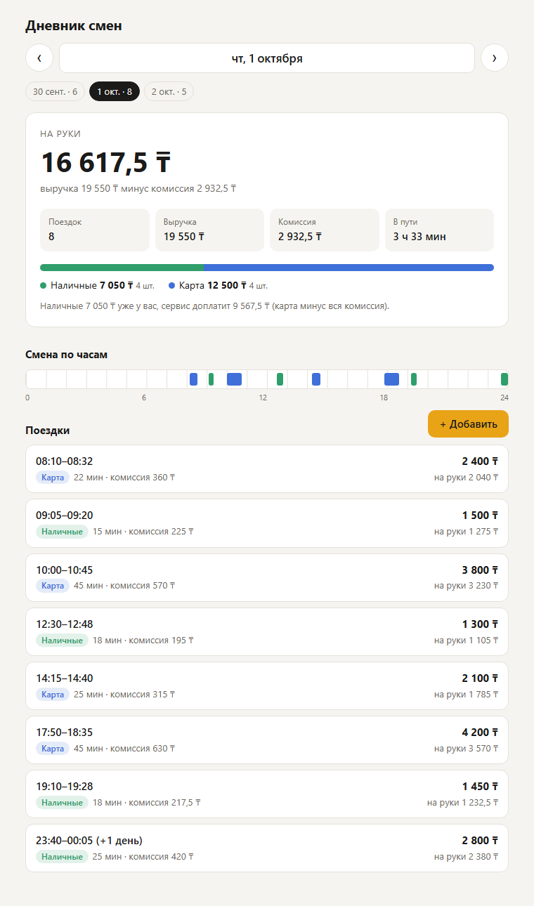
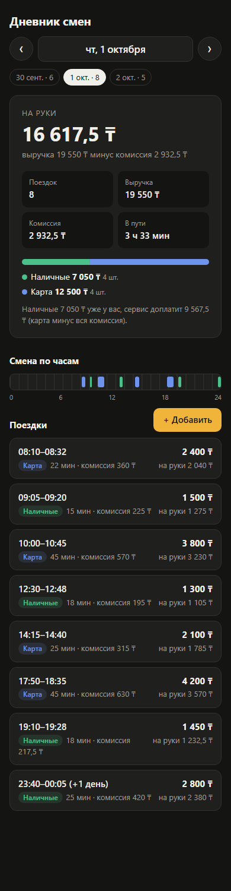

# Дневник смен водителя

Небольшое приложение: сервер с API поездок и сводкой за день + веб-клиент, в котором водитель листает дни, видит выручку, комиссию и сколько остаётся «на руки», и добавляет поездки.

<p>
  
  &nbsp;
  
</p>

## Запуск

Нужен только Node.js 20+ — внешних зависимостей нет, `npm install` не требуется.

```bash
npm start      # http://localhost:3000
npm test       # 19 тестов: сводка, дубли, валидация, HTTP API
```

При первом запуске `data/trips.json` создаётся из примера `data/trips.seed.json` (3 дня, 19 поездок, включая ночную поездку через полночь). Чтобы начать с чистого листа, удалите `data/trips.json`.

Переменные окружения:

| Переменная | По умолчанию | Что задаёт |
| --- | --- | --- |
| `PORT` | `3000` | порт сервера |
| `DATA_FILE` | `data/trips.json` | файл с поездками |
| `UTC_OFFSET` | `+05:00` | часовой пояс водителя — по нему поездка относится к дню |

## Что сделано

1. **API поездок и сводки за день.** `GET /api/trips?date=YYYY-MM-DD` отдаёт поездки дня и сводку: число поездок, выручку, комиссию, «на руки», разбивку наличные/карта.
2. **Клиент.** Сводка, полоса «наличные / карта», шкала смены по часам, список поездок. Дни переключаются стрелками (и клавишами ← →), календарём или чипами дней, где есть поездки; выбранный день хранится в адресе (`/#2026-10-01`). Светлая и тёмная тема, вёрстка под телефон.
3. **Добавление поездки** через `POST /api/trips` с проверкой данных и защитой от дублей. В форме комиссия подставляется как 15% от суммы, ошибки сервера подсвечивают нужные поля.
4. **Тесты** на `node:test`: расчёт сводки, защита от дублей (включая 10 одновременных запросов и повтор после перезапуска), валидация, HTTP API.

## API

### `GET /api/trips?date=2026-10-01`

```json
{
  "date": "2026-10-01",
  "utcOffset": "+05:00",
  "summary": {
    "trips": 8,
    "revenue": 19550,
    "commission": 2932.5,
    "net": 16617.5,
    "byPayment": {
      "cash": { "trips": 4, "revenue": 7050, "commission": 1057.5, "net": 5992.5 },
      "card": { "trips": 4, "revenue": 12500, "commission": 1875, "net": 10625 }
    },
    "serviceBalance": 9567.5,
    "driveMinutes": 213
  },
  "trips": [
    { "id": "t1", "start": "2026-10-01T08:10:00+05:00", "end": "2026-10-01T08:32:00+05:00",
      "amount": 2400, "payment": "card", "commission": 360,
      "date": "2026-10-01", "durationMinutes": 22, "net": 2040 }
  ]
}
```

- `net` («на руки») = выручка − комиссия.
- `serviceBalance` — расчёт с сервисом: оплата картой проходит через сервис, а комиссия удерживается со всех поездок. Если число отрицательное, водитель должен сервису (например, весь день возил за наличные).
- Без `date` берётся сегодняшний день в поясе водителя. Неверная дата → `400 invalid_date`.

Также есть `GET /api/summary?date=` (только сводка) и `GET /api/days` (дни, где есть поездки, с их количеством — для навигации в клиенте).

### `POST /api/trips`

```bash
curl -X POST localhost:3000/api/trips -H "Content-Type: application/json" \
  -d '{"id":"t9","start":"2026-10-03T10:00:00+05:00","end":"2026-10-03T10:20:00+05:00","amount":1700,"payment":"cash","commission":255}'
```

| Ответ | Когда |
| --- | --- |
| `201` `{created: true, trip}` | поездка добавлена |
| `200` `{created: false, duplicate: true, trip}` | такая поездка уже есть — дубль не создан, возвращается существующая |
| `400 validation` | ошибки данных, в `error.details` — список `{field, message}` |
| `409 id_conflict` | этот `id` уже занят поездкой с другими данными |
| `409 overlap` | поездка пересекается по времени с другой |

Проверки: `start`/`end` — ISO 8601 со смещением (`+05:00` или `Z`), реальная дата (`2026-02-30` отклоняется); окончание позже начала; `amount` > 0; `commission` от 0 до суммы; `payment` — `cash` или `card`; деньги — числа, не более двух знаков после запятой.

## Как устроена защита от дублей

Повтор запроса — обычная ситуация: пропала связь, ответ не дошёл, водитель нажал «Сохранить» ещё раз. Поэтому:

- **`id` — ключ идемпотентности.** Клиент генерирует его при открытии формы и не меняет до успешного сохранения, так что повторная отправка приходит с тем же `id`. Тот же `id` + те же данные → `200 duplicate`; тот же `id` + другие данные → `409`.
- **`id` можно не передавать** — тогда он вычисляется как хэш содержимого, и повтор без `id` тоже узнаётся.
- **Та же поездка с другим `id`** (например, клиент сгенерировал новый ключ) тоже считается дублем: сравниваются моменты начала/окончания, сумма, оплата и комиссия. Время сравнивается как момент, поэтому `08:10+05:00` и `03:10Z` — одно и то же.
- **Пересечение по времени** с другой поездкой отклоняется: водитель не может везти два заказа сразу. Это ловит «почти дубли» — ту же поездку, отправленную повторно с исправленной суммой.
- Проверка и вставка выполняются синхронно, без `await` между ними, поэтому одновременные запросы не могут оба пройти проверку. Файл пишется через временный файл и атомарное переименование, записи идут по очереди.

## Решения и допущения

- **К какому дню относится поездка** — по времени начала в поясе водителя (`UTC_OFFSET`). Ночная поездка 23:40–00:05 входит в смену, где началась; в клиенте она помечена «+1 день».
- **Деньги** считаются в целых сотых (тиынах): `0.1 + 0.2` в сводке даёт ровно `0.3`. Комиссия хранится как пришла, без пересчёта процента — сервисы считают её по-разному.
- **Время** разбирается своим кодом, а не `Date.parse`: тот принимает `2026-02-30` и молча превращает его в 2 марта.
- **Хранилище** — JSON-файл: для дневника одного водителя этого хватает. Для нескольких водителей и параллельных процессов следующим шагом была бы SQLite с уникальным индексом по `id`.

## Структура

```
src/
  trips.js     валидация поездки, разбор времени, деньги в тиынах
  summary.js   сводка за день
  store.js     хранилище: идемпотентное добавление, выборка по дню, запись в файл
  server.js    HTTP API на node:http и раздача клиента
  index.js     точка входа, настройки из переменных окружения
public/        клиент: HTML + CSS + JS без сборки
test/          summary.test.js, store.test.js, api.test.js
data/          trips.seed.json — пример данных
```
